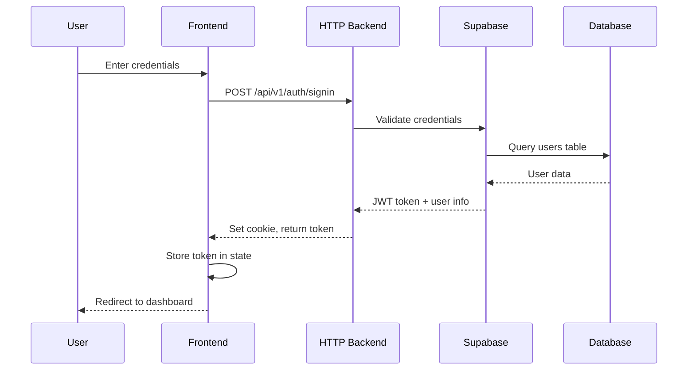
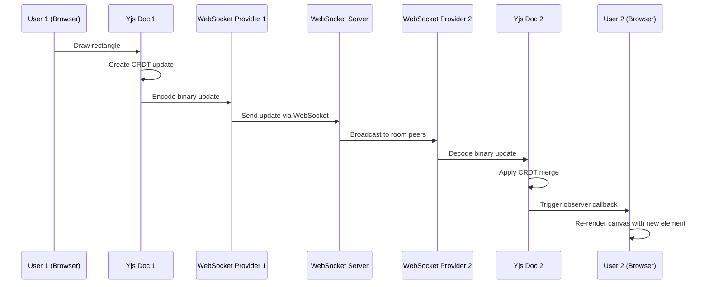
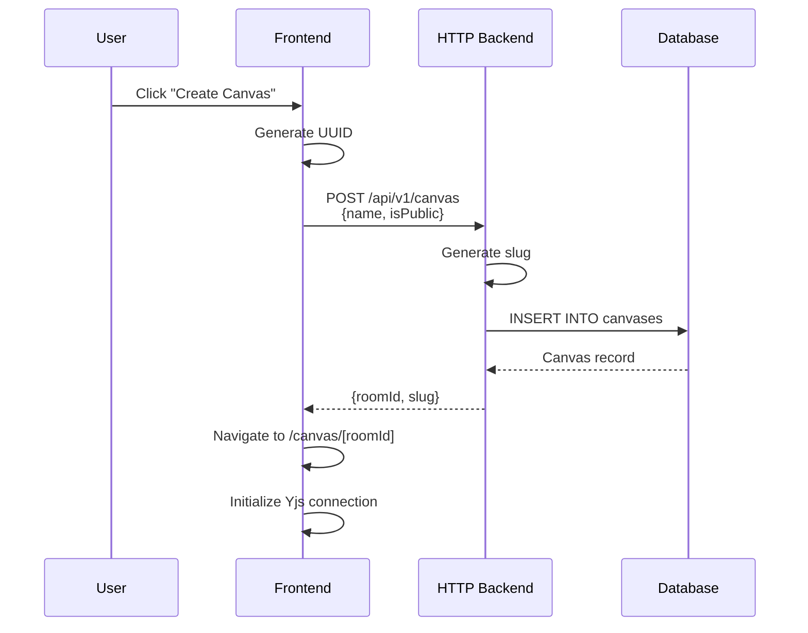
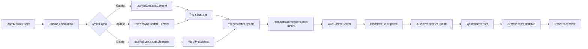
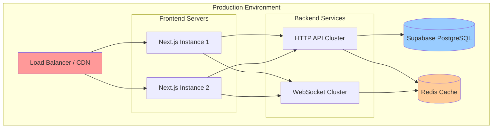

# LekhaFlow Architecture Diagram

```mermaid
graph TB
    subgraph "Client Layer - Next.js Frontend"
        A[User Browser] --> B[Next.js App]
        B --> C[Canvas Component]
        C --> D[Zustand Store]
        C --> E[React Konva Rendering]
        C --> F[useYjsSync Hook]
        F --> G[Yjs Y.Doc]
        F --> H[HocuspocusProvider]
        
        subgraph "UI Components"
            C --> I[Toolbar]
            C --> J[Properties Panel]
            C --> K[Collaborator Cursors]
            C --> L[Export Modal]
        end
        
        B --> M[Auth Wrapper]
        M --> N[Supabase Client]
    end
    
    subgraph "Backend Layer"
        subgraph "HTTP Backend - Express (Port 8000)"
            O[Express Server]
            O --> P[Auth Router]
            O --> Q[Canvas Router]
            P --> R[Auth Controller]
            Q --> S[Canvas Controller]
            R --> T[Auth Middleware]
            S --> T
            S --> U[Canvas Service]
        end
        
        subgraph "WebSocket Backend (Port 8080)"
            V[WebSocket Server]
            V --> W[y-websocket/bin/utils]
            W --> X[setupWSConnection]
        end
    end
    
    subgraph "Database Layer"
        Y[(Supabase PostgreSQL)]
        Y --> Z[Tables: users, canvases]
    end
    
    subgraph "Shared Packages"
        AA[@repo/common]
        AB[@repo/config]
        AC[@repo/http-core]
        AD[@repo/logger]
        AE[@repo/supabase]
        AF[@repo/ui]
    end
    
    H -->|WebSocket Connection Real-time Sync| V
    M -->|HTTP API Calls Auth & Canvas CRUD| O
    N -->|Auth Verification| Y
    
    U -->|Create/Update Canvas| AE
    AE -->|SQL Queries| Y
    
    G -->|Yjs Updates Binary Protocol| H
    X -->|Broadcast to All Clients| H
    
    C -.->|Uses Types| AA
    O -.->|Uses Types| AA
    O -.->|Uses Config| AB
    O -.->|Uses HTTP Utils| AC
    O -.->|Uses DB Client| AE
    B -.->|Uses UI Components| AF
    
    style A fill:#e1f5ff
    style Y fill:#ffe1e1
    style V fill:#fff4e1
    style O fill:#e1ffe1
    style C fill:#f0e1ff
    style G fill:#ffe1f0
```

## System Overview

**LekhaFlow** is a real-time collaborative canvas application built with a modern microservices architecture, enabling multiple users to draw, annotate, and collaborate simultaneously.

---

## Architecture Components

### 1. **Client Layer (Next.js Frontend)**

#### Core Technologies
- **Next.js 14** - React framework with App Router
- **React Konva** - Canvas rendering engine
- **Zustand** - State management
- **Yjs** - CRDT-based synchronization
- **HocuspocusProvider** - WebSocket provider for Yjs

#### Key Components

**Canvas Component** (`apps/web/components/Canvas.tsx`)
- Main drawing surface using React Konva
- Handles mouse/touch interactions
- Renders all canvas elements (rectangles, ellipses, lines, arrows, freedraw, text)
- Supports zoom, pan, and selection
- Real-time collaborative cursor tracking

**useYjsSync Hook** (`apps/web/hooks/useYjsSync.ts`)
- Manages Yjs document and WebSocket connection
- Provides CRUD operations for canvas elements
- Handles awareness for collaborative features (cursors, selections)
- Implements undo/redo functionality
- Synchronizes local state with remote peers

**Zustand Store** (`apps/web/store/canvas-store.ts`)
- Centralized state management
- Stores canvas elements, selected IDs, tool state
- Manages UI state (colors, stroke width, etc.)
- Handles collaborator information
- Connection status tracking

**Auth Wrapper** (`apps/web/components/CanvasAuthWrapper.tsx`)
- Authentication gate for canvas access
- Retrieves JWT token from Supabase
- Passes token to Canvas component for WebSocket auth

---

### 2. **Backend Layer**

#### A. HTTP Backend (Express - Port 8000)

**Purpose**: RESTful API for authentication and canvas metadata

**Routes**:
- `/api/v1/auth/signup` - User registration
- `/api/v1/auth/signin` - User login
- `/api/v1/canvas` - Create new canvas
- `/api/v1/canvas/:roomId` - Update canvas metadata

**Authentication Flow**:
1. User signs up/signs in via HTTP API
2. Supabase validates credentials
3. JWT token returned to client
4. Token stored in cookies (HTTP-only, secure)
5. Token used for WebSocket authentication

**Canvas Service** (`apps/http-backend/src/services/canvas.ts`)
- Creates canvas records in Supabase
- Generates unique slugs for canvas URLs
- Stores canvas metadata (name, owner, visibility)

**Middleware** (`apps/http-backend/src/middleware/auth.ts`)
- Validates JWT tokens
- Extracts user information
- Protects authenticated routes

#### B. WebSocket Backend (Port 8080)

**Purpose**: Real-time synchronization server for collaborative editing

**Technology**: y-websocket library

**Key Features**:
- Lightweight message broker
- Room-based collaboration
- Binary protocol (Yjs CRDT updates)
- Automatic conflict resolution
- Broadcasts changes to all connected clients in same room

**How it Works**:
```javascript
wss.on("connection", (ws, req) => {
    setupWSConnection(ws, req);
    // Yjs handles:
    // - Initial state sync
    // - Incremental updates
    // - Awareness protocol (cursors, selections)
    // - Automatic reconnection
});
```

---

### 3. **Database Layer (Supabase PostgreSQL)**

**Tables**:

**users** (managed by Supabase Auth)
- id (UUID, primary key)
- email
- name
- created_at

**canvases**
- id (UUID, primary key)
- name (string)
- slug (unique string)
- owner_id (UUID, foreign key to users)
- is_public (boolean)
- data (JSONB, nullable - stores canvas state)
- created_at
- updated_at

**Role**: Persistent storage for user accounts and canvas metadata. Real-time canvas state is managed by Yjs and not stored in database during active sessions.

---

### 4. **Shared Packages (Monorepo)**

**@repo/common** (`packages/common`)
- Shared TypeScript types
- Canvas element types (Rectangle, Ellipse, Line, Arrow, Freedraw, Text)
- Validation schemas (Zod)
- Tool types and interfaces

**@repo/config** (`packages/config`)
- Environment variable configuration
- Shared environment validation
- Client/server config split

**@repo/http-core** (`packages/http-core`)
- HTTP response utilities
- Error handling classes
- JSON response helpers

**@repo/supabase** (`packages/supabase`)
- Supabase client initialization
- Database type definitions
- Auth utilities

**@repo/ui** (`packages/ui`)
- Shared React components (Button, Card, Input)
- Consistent design system

---

## Data Flow Diagrams

### 1. Authentication Flow



### 2. Real-time Collaboration Flow



### 3. Canvas Creation Flow



### 4. Element Synchronization Flow



---

## Key Architectural Patterns

### 1. **CQRS (Command Query Responsibility Segregation)**
- **Commands**: Canvas mutations go through Yjs (WebSocket)
- **Queries**: Canvas metadata queries go through HTTP API

### 2. **CRDT (Conflict-free Replicated Data Type)**
- Yjs provides automatic conflict resolution
- No need for operational transforms
- Eventually consistent state across all clients
- Works offline and syncs when reconnected

### 3. **Monorepo Structure (Turborepo)**
- Shared packages for code reuse
- Independent deployment of services
- Type safety across boundaries
- Fast incremental builds

### 4. **Event-Driven Architecture**
- Yjs observers react to document changes
- Zustand subscribeWithSelector for fine-grained reactivity
- WebSocket events for real-time updates

### 5. **Separation of Concerns**
- **UI Layer**: React components (presentation)
- **State Layer**: Zustand store (application state)
- **Sync Layer**: Yjs + HocuspocusProvider (data synchronization)
- **Persistence Layer**: Supabase (durable storage)

---

## Technology Stack Summary

### Frontend
- **Framework**: Next.js 14 (App Router)
- **UI Library**: React 18
- **Canvas**: React Konva
- **State**: Zustand
- **Sync**: Yjs + HocuspocusProvider
- **Auth**: Supabase Auth
- **Styling**: Tailwind CSS
- **Icons**: Lucide React

### Backend
- **HTTP Server**: Express.js
- **WebSocket**: ws + y-websocket
- **Database**: Supabase (PostgreSQL)
- **Validation**: Zod
- **Auth**: Supabase Auth (JWT)

### DevOps
- **Monorepo**: Turborepo
- **Package Manager**: pnpm
- **Linter**: ESLint + Biome
- **TypeScript**: Strict mode
- **API Testing**: Bruno

---

## Scaling Considerations

### Current Architecture
- Single WebSocket server (Port 8080)
- Single HTTP API server (Port 8000)
- Supabase hosted database

### Future Scaling Options

1. **Horizontal Scaling of WebSocket Server**
   - Use Redis pub/sub for cross-server communication
   - Implement sticky sessions or session affinity
   - Deploy multiple WS instances behind load balancer

2. **Database Optimization**
   - Add read replicas for canvas metadata queries
   - Implement caching layer (Redis)
   - Partition canvases table by date

3. **CDN Integration**
   - Serve static assets via CDN
   - Cache canvas snapshots for faster loading

4. **Microservices Decomposition**
   - Separate auth service
   - Dedicated canvas service
   - Analytics service

---

## Security Features

1. **JWT-based Authentication**
   - HTTP-only cookies
   - Token expiration
   - Refresh token rotation

2. **Authorization**
   - Owner-based canvas access control
   - Public/private canvas visibility
   - Middleware protection for sensitive routes

3. **Input Validation**
   - Zod schemas for request validation
   - Type-safe API contracts
   - SQL injection prevention (Supabase ORM)

4. **WebSocket Security**
   - Token-based WebSocket authentication
   - Room isolation
   - Rate limiting (future enhancement)

---

## Performance Optimizations

1. **Yjs Binary Protocol**
   - Efficient CRDT encoding
   - Minimal network payload
   - Delta-based updates (only changes transmitted)

2. **React Optimizations**
   - useShallow for Zustand selectors
   - Memoized callbacks
   - Konva layer caching

3. **Lazy Loading**
   - Code splitting (Next.js automatic)
   - Dynamic imports for heavy components

4. **WebSocket Compression**
   - Binary message format
   - Awareness state debouncing

---

## Development Workflow

1. **Local Development**
```bash
# Install dependencies
pnpm install

# Start all services
pnpm dev

# Services running:
# - Frontend: http://localhost:3000
# - HTTP Backend: http://localhost:8000
# - WebSocket Backend: ws://localhost:8080
```

2. **Building**
```bash
pnpm build   # Build all packages and apps
```

3. **Testing APIs**
- Use Bruno collection in `canvas/bruno/` directory
- Pre-configured requests for auth and canvas operations

---

## Deployment Architecture



---

## Future Enhancements

1. **Real-time Permissions**
   - Granular role-based access control
   - Invite collaborators by email
   - View-only mode

2. **Canvas Versioning**
   - Snapshot history
   - Time-travel debugging
   - Restore previous versions

3. **Advanced Collaboration**
   - Voice/video chat integration
   - Presence indicators
   - User avatars

4. **Export Formats**
   - PNG/JPG image export
   - SVG vector export
   - PDF generation

5. **AI Integration**
   - Shape recognition
   - Auto-complete drawings
   - Smart layout suggestions

---

## Conclusion

LekhaFlow demonstrates a modern, scalable architecture for real-time collaborative applications. The separation between HTTP API (for metadata) and WebSocket (for real-time sync) provides flexibility, while Yjs CRDT ensures conflict-free collaboration without complex server-side logic.

The monorepo structure with shared packages ensures type safety and code reuse across all services, making the codebase maintainable and developer-friendly.
