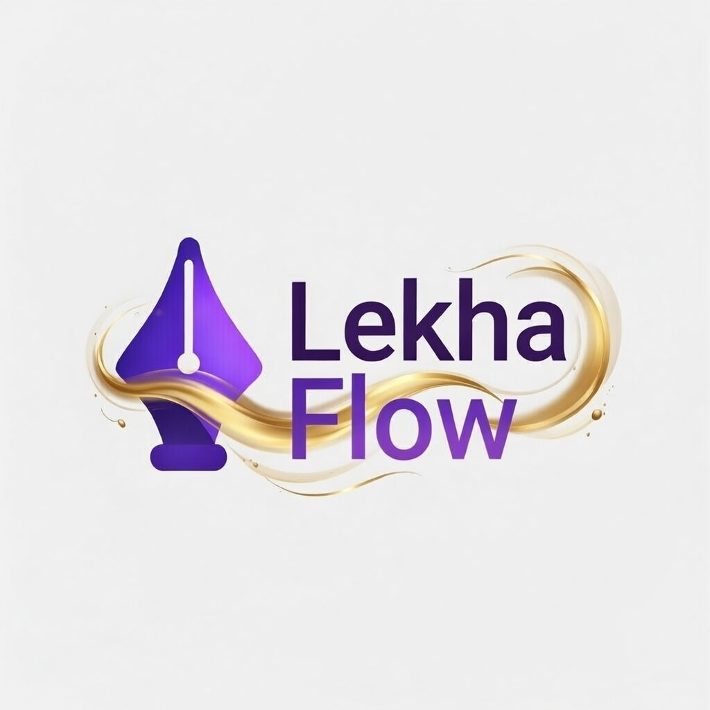

<p align="center">
  
</p>

<h1 align="center">LekhaFlow</h1>

<p align="center">
  <b>A real-time collaborative canvas platform built for teams</b>
</p>

<p align="center">
  <a href="#features">Features</a> •
  <a href="#architecture">Architecture</a> •
  <a href="#tech-stack">Tech Stack</a> •
  <a href="#getting-started">Getting Started</a> •
  <a href="#api-documentation">API Docs</a> •
  <a href="#database-schema">Schema</a> •
  <a href="#testing">Testing</a> •
  <a href="#contributors">Contributors</a>
</p>

---

## About

**LekhaFlow** is an open-source, real-time collaborative whiteboard application inspired by Excalidraw. It enables multiple users to draw, sketch, and brainstorm on a shared canvas simultaneously with live cursor tracking, auto-save, and persistent storage.

Built as a monorepo using **Turborepo**, LekhaFlow comprises a **Next.js** frontend, an **Express** HTTP API server, and a **Hocuspocus** WebSocket server — all sharing common packages for types, configuration, and utilities.

---

## Features

| Category               | Feature                                                                                                |
| ---------------------- | ------------------------------------------------------------------------------------------------------ |
| **Drawing Tools**      | Rectangle, Ellipse, Diamond, Line, Arrow, Freehand draw, Text, Eraser, Laser pointer                   |
| **Element Operations** | Select, Move, Resize (8-handle), Rotate, Delete, Duplicate, Lock                                       |
| **Styling**            | Fill color, Stroke color, Stroke width, Stroke style (solid/dashed/dotted), Opacity, Fill style        |
| **Canvas Controls**    | Infinite canvas pan, Zoom in/out/reset, Fit to screen, Grid toggle                                     |
| **Collaboration**      | Real-time multi-user editing via Yjs CRDT, Live collaborator cursors, Connection status indicator      |
| **Persistence**        | Auto-save to Supabase PostgreSQL via WebSocket, Canvas CRUD operations via REST API                    |
| **Authentication**     | Google OAuth via Supabase, Email/password signup & signin, JWT-based session management                |
| **Dashboard**          | List owned & shared canvases, Create/rename/delete canvases, Share via link                            |
| **Export**             | PNG, SVG, JSON export with customizable options                                                        |
| **UX**                 | Keyboard shortcuts (Delete, Ctrl+Z, Ctrl+Y, Ctrl+A, etc.), Context menu, Help panel, Undo/Redo history |

---

## Architecture

### High-Level Architecture Diagram


### Use Case Diagram


### Sequence Diagram — Real-time Collaboration Flow


---

## Tech Stack

| Layer                | Technology                                                   |
| -------------------- | ------------------------------------------------------------ |
| **Frontend**         | Next.js 16, React 19, TypeScript, Tailwind CSS, Zustand      |
| **Canvas Rendering** | HTML5 Canvas (custom renderer), Perfect Freehand             |
| **Real-time Sync**   | Yjs (CRDT), Hocuspocus (WebSocket server & client provider)  |
| **HTTP Backend**     | Express 5, Zod validation, http-status-codes                 |
| **Database & Auth**  | Supabase (PostgreSQL + Auth + Google OAuth)                  |
| **Monorepo Tooling** | Turborepo, pnpm workspaces                                   |
| **Code Quality**     | Biome (linter + formatter), ESLint, Husky (pre-commit hooks) |
| **Testing**          | Vitest, React Testing Library, happy-dom                     |
| **CI/CD**            | GitHub Actions (lint + build pipeline)                       |

---

## Project Structure

```
canvas/                          # Monorepo root
├── apps/
│   ├── web/                     # Next.js frontend (port 3000)
│   │   ├── app/                 #   App router pages
│   │   │   ├── auth/callback/   #     OAuth callback handler
│   │   │   ├── canvas/[roomId]/ #     Canvas editor page
│   │   │   ├── login/           #     Login page
│   │   │   └── room/[roomId]/   #     Room page with auth guard
│   │   ├── components/
│   │   │   ├── Canvas.tsx       #     Main canvas renderer (2150+ LOC)
│   │   │   ├── Dashboard.tsx    #     Canvas management dashboard
│   │   │   ├── CanvasAuthWrapper.tsx
│   │   │   └── canvas/          #     Canvas sub-components
│   │   │       ├── Toolbar.tsx
│   │   │       ├── Header.tsx
│   │   │       ├── PropertiesPanel.tsx
│   │   │       ├── ZoomControls.tsx
│   │   │       ├── CollaboratorCursors.tsx
│   │   │       ├── ConnectionStatus.tsx
│   │   │       ├── ContextMenu.tsx
│   │   │       ├── ExportModal.tsx
│   │   │       ├── HelpPanel.tsx
│   │   │       ├── ResizeHandles.tsx
│   │   │       └── RotationControls.tsx
│   │   ├── hooks/
│   │   │   └── useYjsSync.ts    #   Yjs + Hocuspocus sync hook
│   │   ├── store/
│   │   │   └── canvas-store.ts  #   Zustand state management
│   │   ├── lib/
│   │   │   ├── element-utils.ts #   Hit-testing, bounding box, transforms
│   │   │   └── stroke-utils.ts  #   Freehand stroke processing
│   │   └── test/                #   Frontend test suites
│   │
│   ├── http-backend/            # Express REST API (port 8000)
│   │   └── src/
│   │       ├── controller/      #   Route handlers (auth, canvas)
│   │       ├── middleware/      #   JWT auth middleware
│   │       ├── routes/          #   Route definitions
│   │       ├── services/        #   Business logic layer
│   │       └── error/           #   Global error handler
│   │
│   └── ws-backend/              # Hocuspocus WebSocket server (port 8080)
│       └── src/
│           └── index.ts         #   Server config, DB persistence, auth
│
├── packages/                    # Shared packages
│   ├── common/                  #   Shared types & Zod schemas
│   ├── config/                  #   Environment variable management
│   ├── http-core/               #   HTTP response utilities
│   ├── logger/                  #   Logging utilities
│   ├── supabase/                #   Supabase generated types
│   ├── ui/                      #   Shared UI components
│   ├── eslint-config/           #   Shared ESLint configs
│   └── typescript-config/       #   Shared tsconfig presets
│
├── bruno/                       # API testing collection (Bruno)
├── turbo.json                   # Turborepo pipeline config
├── pnpm-workspace.yaml          # Workspace definition
└── biome.json                   # Biome linter/formatter config
```

---

## Getting Started

### Prerequisites

| Tool                 | Version                                        |
| -------------------- | ---------------------------------------------- |
| **Node.js**          | ≥ 18                                           |
| **pnpm**             | ≥ 10.28.0                                      |
| **Supabase Project** | [Create one →](https://supabase.com/dashboard) |

### 1. Clone the Repository

```bash
git clone https://github.com/anusanth26/LekhaFlow.git
cd LekhaFlow/canvas
```

### 2. Install Dependencies

```bash
pnpm install
```

### 3. Environment Setup

Create a `.env` file in the `canvas/` root directory:

```env
# Server-side (http-backend & ws-backend)
SUPABASE_URL="your_supabase_url"
SUPABASE_SERVICE_KEY="your_supabase_service_key"
NODE_ENV="development"
WS_PORT="8080"

# Client-side (Next.js web app)
NEXT_PUBLIC_SUPABASE_URL="your_supabase_url"
NEXT_PUBLIC_SUPABASE_ANON_KEY="your_supabase_anon_key"
NEXT_PUBLIC_WS_URL="ws://localhost:8080"
NEXT_PUBLIC_HTTP_URL="http://localhost:8000"
```

> Copy from the example: `cp .env.example .env` and fill in your Supabase credentials.

### 4. Database Setup

Run the following SQL in your Supabase SQL editor:

```sql
-- Users table (synced from Supabase Auth)
CREATE TABLE users (
    id UUID PRIMARY KEY REFERENCES auth.users(id),
    email TEXT NOT NULL,
    name TEXT,
    avatar_url TEXT,
    created_at TIMESTAMPTZ DEFAULT NOW(),
    updated_at TIMESTAMPTZ DEFAULT NOW()
);

-- Canvases table
CREATE TABLE canvases (
    id UUID PRIMARY KEY DEFAULT gen_random_uuid(),
    name TEXT NOT NULL,
    slug TEXT UNIQUE NOT NULL,
    owner_id UUID NOT NULL REFERENCES users(id),
    data BYTEA,
    is_public BOOLEAN DEFAULT FALSE,
    is_deleted BOOLEAN DEFAULT FALSE,
    created_at TIMESTAMPTZ DEFAULT NOW(),
    updated_at TIMESTAMPTZ DEFAULT NOW()
);

-- Activity logs (tracks shared canvas access)
CREATE TABLE activity_logs (
    id UUID PRIMARY KEY DEFAULT gen_random_uuid(),
    canvas_id UUID REFERENCES canvases(id),
    user_id UUID REFERENCES users(id),
    action TEXT NOT NULL,
    details JSONB,
    created_at TIMESTAMPTZ DEFAULT NOW()
);

-- Enable Row Level Security
ALTER TABLE users ENABLE ROW LEVEL SECURITY;
ALTER TABLE canvases ENABLE ROW LEVEL SECURITY;
ALTER TABLE activity_logs ENABLE ROW LEVEL SECURITY;
```

### 5. Configure Google OAuth (Supabase Dashboard)

1. Go to **Authentication → Providers → Google**
2. Enable Google provider
3. Add your Google OAuth Client ID and Secret
4. Set redirect URL: `http://localhost:3000/auth/callback`

### 6. Run Development Servers

```bash
pnpm dev
```

This starts all three services concurrently via Turborepo:

| Service       | URL                     | Description                     |
| ------------- | ----------------------- | ------------------------------- |
| **Web App**   | `http://localhost:3000` | Next.js frontend                |
| **HTTP API**  | `http://localhost:8000` | Express REST API                |
| **WebSocket** | `ws://localhost:8080`   | Hocuspocus collaboration server |

### 7. Build for Production

```bash
pnpm build
```

### Available Scripts

| Command            | Description                              |
| ------------------ | ---------------------------------------- |
| `pnpm dev`         | Start all services in development mode   |
| `pnpm build`       | Build all packages and apps              |
| `pnpm lint`        | Run linting across all packages          |
| `pnpm check`       | Run Biome checks with auto-fix           |
| `pnpm format`      | Format code with Biome                   |
| `pnpm check-types` | TypeScript type checking across monorepo |

---

## API Documentation

**Base URL:** `http://localhost:8000/api/v1`

All 🔒 endpoints require the header:

```
Authorization: Bearer <supabase_jwt_token>
```

### Authentication Endpoints

#### `POST /auth/signup`

Register a new user.

**Request Body:**

```json
{
  "email": "user@example.com",
  "password": "securepassword",
  "name": "John Doe"
}
```

**Validation:** `email` (valid email), `password` (min 6 chars), `name` (min 1 char)

**Response:** `201 Created`

```json
{
  "status": 201,
  "message": "User created successfully. Check email for verification.",
  "data": {
    "user": { "id": "uuid", "email": "user@example.com" }
  }
}
```

---

#### `POST /auth/signin`

Sign in with email and password. Returns JWT token and sets `access_token` cookie.

**Request Body:**

```json
{
  "email": "user@example.com",
  "password": "securepassword"
}
```

**Response:** `200 OK`

```json
{
  "status": 200,
  "message": "Signed in successfully",
  "data": {
    "user": { "id": "uuid", "email": "user@example.com" },
    "token": "eyJhbGciOiJIUzI1NiIs..."
  }
}
```

**Cookie:** `access_token` (httpOnly, secure in production, sameSite: strict, 7-day expiry)

---

#### `GET /auth/me` 🔒

Get current authenticated user's profile.

**Response:** `200 OK`

```json
{
  "status": 200,
  "message": "User profile",
  "data": {
    "user": {
      "id": "uuid",
      "email": "user@example.com",
      "name": "John Doe",
      "avatar_url": "https://..."
    }
  }
}
```

---

#### `POST /auth/sync-user` 🔒

Sync/upsert user profile from OAuth provider into `users` table.

**Response:** `200 OK`

---

### Canvas Endpoints

#### `POST /canvas/create-canvas` 🔒

Create a new canvas.

**Request Body:**

```json
{
  "name": "My Whiteboard",
  "isPublic": false
}
```

**Validation:** `name` (1–50 chars, required), `isPublic` (boolean, optional, default `false`)

**Response:** `201 Created`

```json
{
  "status": 201,
  "message": "Canvas created successfully",
  "data": {
    "roomId": "550e8400-e29b-41d4-a716-446655440000",
    "slug": "my-whiteboard-1707600000000"
  }
}
```

---

#### `GET /canvas` 🔒

List all canvases accessible to the user (owned + shared via activity logs).

**Response:** `200 OK`

```json
{
  "status": 200,
  "message": "Canvases retrieved successfully",
  "data": {
    "canvases": [
      {
        "id": "uuid",
        "name": "My Whiteboard",
        "slug": "my-whiteboard-1707600000000",
        "owner_id": "uuid",
        "is_public": false,
        "is_deleted": false,
        "created_at": "2025-02-11T10:00:00.000Z",
        "updated_at": "2025-02-11T12:30:00.000Z"
      }
    ]
  }
}
```

---

#### `GET /canvas/:roomId` 🔒

Retrieve a specific canvas by its room ID.

**Response:** `200 OK` / `404 Not Found`

```json
{
  "status": 200,
  "message": "Canvas retrieved successfully",
  "data": {
    "canvas": {
      "id": "uuid",
      "name": "My Whiteboard",
      "slug": "my-whiteboard-1707600000000",
      "owner_id": "uuid",
      "is_public": false,
      "is_deleted": false,
      "data": null,
      "created_at": "2025-02-11T10:00:00.000Z",
      "updated_at": "2025-02-11T12:30:00.000Z"
    }
  }
}
```

---

#### `PUT /canvas/:roomId` 🔒

Update canvas name or data (owner only).

**Request Body:**

```json
{
  "name": "Renamed Canvas",
  "data": "<optional string data>"
}
```

**Validation:** `name` (1–50 chars, optional), `data` (string, optional)

**Response:** `200 OK`

```json
{
  "status": 200,
  "message": "Canvas updated successfully"
}
```

---

#### `DELETE /canvas/:roomId` 🔒

Soft-delete a canvas (owner only). Sets `is_deleted = true`.

**Response:** `200 OK`

```json
{
  "status": 200,
  "message": "Canvas deleted successfully"
}
```

---

### API Error Responses

All errors follow a consistent format:

```json
{
  "status": 400,
  "message": "Validation Failed: Invalid input"
}
```

| Status Code | Meaning                                          |
| ----------- | ------------------------------------------------ |
| `400`       | Bad Request — validation error or missing fields |
| `401`       | Unauthorized — missing or invalid JWT token      |
| `404`       | Not Found — resource does not exist              |
| `500`       | Internal Server Error                            |

---

### WebSocket API (Real-time Collaboration)

**URL:** `ws://localhost:8080`

LekhaFlow uses the [Hocuspocus](https://tiptap.dev/hocuspocus) protocol built on **Yjs CRDT** for conflict-free real-time collaboration.

**Client Connection Example:**

```typescript
import { HocuspocusProvider } from "@hocuspocus/provider";
import * as Y from "yjs";

const ydoc = new Y.Doc();
const provider = new HocuspocusProvider({
  url: "ws://localhost:8080",
  name: roomId, // Canvas UUID as document name
  document: ydoc,
  token: jwtToken, // Supabase JWT for authentication
});

// Access shared element map
const elementsMap = ydoc.getMap("elements");

// Access awareness (cursors, selections)
provider.awareness.setLocalState({
  user: { id: "...", name: "...", color: "#..." },
  cursor: { x: 100, y: 200 },
});
```

**Protocol Events:**

| Event            | Description                                                      |
| ---------------- | ---------------------------------------------------------------- |
| `onAuthenticate` | Validates JWT against Supabase, logs canvas access               |
| `fetch`          | Loads persisted Yjs binary state from `canvases.data` column     |
| `store`          | Auto-saves Yjs binary state to Supabase on every document change |
| `awareness`      | Broadcasts cursor positions, user identities, active selections  |

---

## Database Schema

### Entity Relationship Diagram


### Column Details

**`users`** — Stores user profiles synced from Supabase Auth.

| Column       | Type        | Description                 |
| ------------ | ----------- | --------------------------- |
| `id`         | UUID (PK)   | References `auth.users(id)` |
| `email`      | TEXT        | User's email address        |
| `name`       | TEXT        | Display name                |
| `avatar_url` | TEXT        | Profile image URL           |
| `created_at` | TIMESTAMPTZ | Account creation timestamp  |
| `updated_at` | TIMESTAMPTZ | Last profile update         |

**`canvases`** — Canvas documents with Yjs binary state.

| Column       | Type          | Description                                                 |
| ------------ | ------------- | ----------------------------------------------------------- |
| `id`         | UUID (PK)     | Canvas unique identifier (used as WebSocket `documentName`) |
| `name`       | TEXT          | User-facing canvas name                                     |
| `slug`       | TEXT (UNIQUE) | URL-friendly slug                                           |
| `owner_id`   | UUID (FK)     | Canvas creator                                              |
| `data`       | BYTEA         | Yjs document binary state (hex-encoded)                     |
| `is_public`  | BOOLEAN       | Public sharing flag                                         |
| `is_deleted` | BOOLEAN       | Soft delete flag                                            |
| `created_at` | TIMESTAMPTZ   | Creation timestamp                                          |
| `updated_at` | TIMESTAMPTZ   | Last save timestamp                                         |

**`activity_logs`** — Tracks user interactions for shared canvas discovery.

| Column       | Type        | Description                                   |
| ------------ | ----------- | --------------------------------------------- |
| `id`         | UUID (PK)   | Log entry identifier                          |
| `canvas_id`  | UUID (FK)   | Referenced canvas                             |
| `user_id`    | UUID (FK)   | User who performed the action                 |
| `action`     | TEXT        | Action type: `accessed`, `created`, `deleted` |
| `details`    | JSONB       | Optional metadata                             |
| `created_at` | TIMESTAMPTZ | Timestamp of action                           |

---

## State Management

LekhaFlow uses **Zustand** for client-side state management with the following architecture:

```
┌─────────────────────────────────────────────────────────────┐
│                       CANVAS STORE                           │
├─────────────────────────────────────────────────────────────┤
│                                                              │
│  Elements State          UI State            Collaborators   │
│  ┌──────────────┐       ┌──────────────┐    ┌────────────┐  │
│  │ elements[]   │       │ activeTool   │    │ users[]    │  │
│  │ selectedIds  │       │ strokeColor  │    │ isConnected│  │
│  │ undoStack    │       │ bgColor      │    │ isSynced   │  │
│  │ redoStack    │       │ strokeWidth  │    └────────────┘  │
│  └──────────────┘       │ opacity      │                    │
│                          └──────────────┘                    │
│                                                              │
│  Actions: addElement, updateElement, deleteElement,          │
│           setTool, setColors, undo, redo, selectAll, etc.   │
└─────────────────────────────────────────────────────────────┘
```

**Data Flow:**

1. User action (click, drag) → triggers Zustand store action
2. Store action → updates **Yjs document** (not React state directly)
3. Yjs broadcasts update to all connected clients via WebSocket
4. Yjs observer fires → updates Zustand store → React re-renders

---

## Testing

LekhaFlow includes comprehensive test coverage across all layers.

```bash
# Run all tests across the monorepo
pnpm test

# Run frontend tests in watch mode
cd apps/web && pnpm test:watch

# Run specific test suites
cd apps/web && pnpm vitest run test/canvas-store.test.ts
cd apps/web && pnpm vitest run test/element-utils.test.ts
cd apps/web && pnpm vitest run test/useYjsSync.test.ts
cd apps/web && pnpm vitest run test/ui-integration.test.tsx

# Backend tests
cd apps/http-backend && pnpm test
cd apps/ws-backend && pnpm test
```

### Test Suites

| Suite                 | Location                                          | Coverage                                               |
| --------------------- | ------------------------------------------------- | ------------------------------------------------------ |
| **Canvas Store**      | `apps/web/test/canvas-store.test.ts`              | UI state, element CRUD, bulk actions, undo/redo        |
| **Element Utilities** | `apps/web/test/element-utils.test.ts`             | Hit-testing, bounding box, point transforms            |
| **Yjs Sync Hook**     | `apps/web/test/useYjsSync.test.ts`                | Connection lifecycle, awareness, document updates      |
| **UI Integration**    | `apps/web/test/ui-integration.test.tsx`           | Toolbar, zoom controls, auth flows, keyboard shortcuts |
| **Canvas API**        | `apps/http-backend/src/controller/canvas.test.ts` | Canvas creation, authorization checks                  |
| **WS Persistence**    | `apps/ws-backend/test/database.test.ts`           | Fetch/store lifecycle, binary encoding                 |

---

## Keyboard Shortcuts

| Shortcut                        | Action                   |
| ------------------------------- | ------------------------ |
| `V`                             | Selection tool           |
| `R`                             | Rectangle                |
| `O`                             | Ellipse                  |
| `D`                             | Diamond                  |
| `L`                             | Line                     |
| `A`                             | Arrow                    |
| `P`                             | Freehand draw            |
| `T`                             | Text                     |
| `H`                             | Hand (pan)               |
| `Delete` / `Backspace`          | Delete selected elements |
| `Ctrl + Z`                      | Undo                     |
| `Ctrl + Y` / `Ctrl + Shift + Z` | Redo                     |
| `Ctrl + A`                      | Select all               |
| `Ctrl + D`                      | Duplicate selected       |
| `Ctrl + +` / `Ctrl + -`         | Zoom in / out            |
| `Ctrl + 0`                      | Reset zoom to 100%       |
| `?`                             | Toggle help panel        |

---

## API Testing with Bruno

The project includes a [Bruno](https://www.usebruno.com/) collection for API testing:

```
bruno/
├── SignUp.bru            # Register a new user
├── SignIn.bru            # Sign in and get JWT
├── SignIn_New.bru        # Alternate sign in
├── CreateCanvas.bru      # Create a new canvas
├── UpdateCanvas.bru      # Update canvas
└── LekhaFlow/            # Environment & workspace config
```

Import the `bruno/` folder into Bruno to test all API endpoints interactively.

---

## Contributors

<table>
  <tr>
    <td align="center">
      <a href="https://github.com/Ananthakrishnan-47">
        
        <br />
        <sub><b>Ananthakrishnan-47</b></sub>
      </a>
    </td>
     <td align="center">
      <a href="https://github.com/anusanth26">
        
        <br />
        <sub><b>anusanth26</b></sub>
      </a>
    </td>
    <td align="center">
      <a href="https://github.com/Rishiikesh-20">
        
        <br />
        <sub><b>Rishiikesh-20</b></sub>
      </a>
    </td>
    <td align="center">
      <a href="https://github.com/Goldmauler">
        
        <br />
        <sub><b>Goldmauler</b></sub>
      </a>
    </td>
    <td align="center">
      <a href="https://github.com/Jeevan0814">
        
        <br />
        <sub><b>Jeevan0814</b></sub>
      </a>
    </td>
  </tr>
</table>

---


<p align="center">Built with ❤️ by the LekhaFlow team</p>
